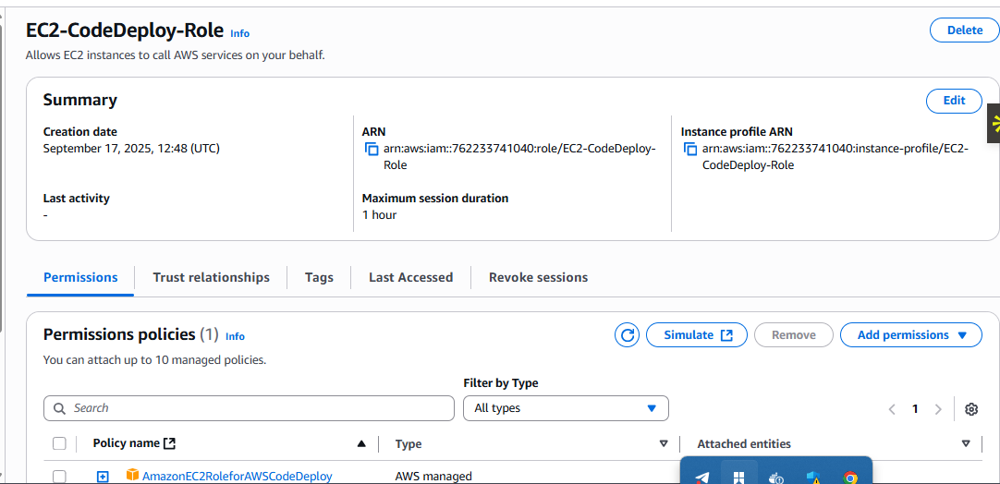
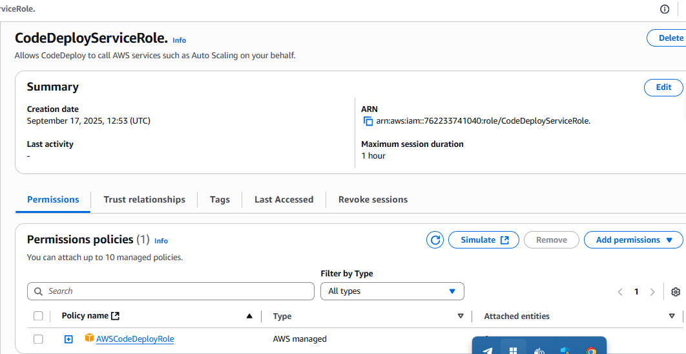

# AWS EC2 CI/CD Pipeline

Automate deployment to an AWS EC2 instance using a continuous integration and continuous delivery (CI/CD) pipeline powered by **IAM Roles, AWS CodePipeline, Github, and CodeDeploy**.

## Setup & Installation

 - Step 1: Create IAM Roles

EC2 IAM Role (Instance Profile)

Go to IAM > Roles > Create role

Select AWS service → EC2

Attach the following policy:

`AmazonEC2RoleforAWSCodeDeploy`

Name it something like: `EC2-CodeDeploy-Role`

This role will be attached to your EC2 instance.

CodeDeploy Service Role

Go to IAM > Roles > Create role

Select AWS service → CodeDeploy

Attach: `AWSCodeDeployRole`

Name it something like: `CodeDeployServiceRole.`

- Step two: Launch and Configure EC2 Instance

AMI- Amazon Linux

When creating your EC2 instance, add this **User Data** script.

#!/bin/bash
sudo yum -y update
sudo yum -y install ruby
sudo yum -y install wget
cd /home/ec2-user
wget https://aws-codedeploy-ap-south-1.s3.ap-south-1.amazonaws.com/latest/install
sudo chmod +x ./install
sudo ./install auto
sudo yum install -y python-pip
sudo pip install awscli

`This script installs the CodeDeploy agent, AWS CLI, and required dependencies.`

`Add the EC2 Codedeploy IAM role during EC2 configuration.`

 - Step 3: Create a CodeDeploy Application & Deployment Group

Navigate to AWS CodeDeploy Console → Applications → Create application.

Name: `MyWebApp`

Compute platform: EC2/On-premises.

Create a Deployment Group:

Name: MyWebApp-DeploymentGroup

Choose the Service Role created earlier (CodeDeployServiceRole).

Select EC2 instances by Tag or Auto Scaling Group.

Deployment type: In-place.

Choose AppSpec file (already included in this repo).

- Step 4: Create a CodePipeline

Navigate to AWS CodePipeline → Create pipeline.

Pipeline name: `MyWebAppPipeline.`

Category: Build Custom Pipeline

Add Source Stage

Provider: GitHub via app.

Connect your GitHub repo (https://github.com/YOUR_USERNAME/repo).

Branch: main.

Add Deploy Stage

Provider: AWS CodeDeploy (EC2/On-premises).

Application name: MyWebApp.
Deployment group: MyWebApp-DeploymentGroup.

`Once created, the pipeline will automatically run whenever you push changes to the GitHub repository.`

After setting up the pipeline, the workflow looks like this when code changes is made:

 **Make Code Changes**  
   Update your application code locally. For example, edit your `index.html` file. 

   Within a few moments, your updated code is deployed and visible when you refresh the application in the browser.

   